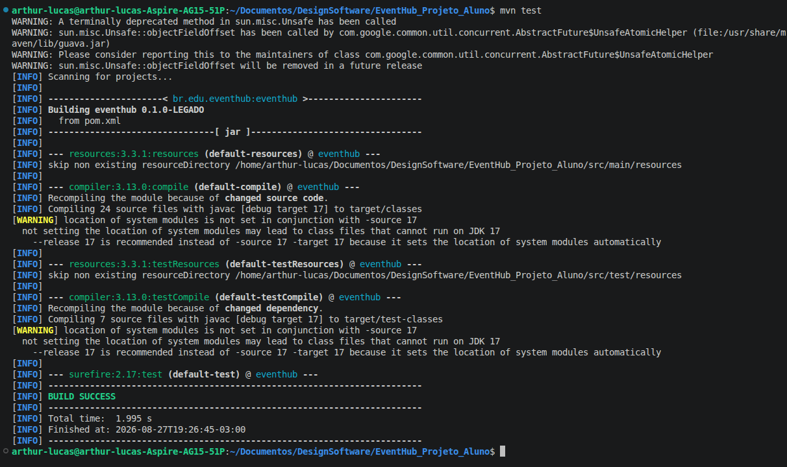

# Aula 04 — decisões de design

## Participantes
- Arthur Lucas P. Santos
- Augusto Alencar
- Artur Akira

---

## P01 — Dependências recebidas no construtor

### Decisão
O `EventHubService` deixa de criar as próprias dependências e passa a recebê-las pelo construtor.
Quem monta os objetos e liga tudo é o `Main`.

### Motivo
A classe dava `new` nas seis coisas que usava. Isso significa que ninguém de fora tinha como trocar
nenhuma delas: pra testar uma inscrição você era obrigado a cobrar de verdade e mandar e-mail de verdade,
porque o serviço sempre fabricava o gateway e a API de e-mail reais. Trocar qualquer integração exigia
editar o serviço.

### Antes
```java
private final PaymentLegacyGateway payment = new PaymentLegacyGateway();
private final QrCodeLegacyApi qr = new QrCodeLegacyApi();
private final EmailLegacyApi email = new EmailLegacyApi();
private final SupplierLegacyApi suppliers = new SupplierLegacyApi();
private final PricingService pricing = new PricingService();
private final EventPublisher publisher = new EventPublisher();

public EventHubService() {
    publisher.subscribe(new AttendeeObserver());
    publisher.subscribe(new OrganizerObserver());
}
```

### Depois
```java
private final PaymentLegacyGateway payment;
private final QrCodeLegacyApi qr;
private final EmailLegacyApi email;
private final SupplierLegacyApi suppliers;
private final PricingService pricing;
private final EventPublisher publisher;

public EventHubService(PaymentLegacyGateway payment, QrCodeLegacyApi qr, EmailLegacyApi email,
                       SupplierLegacyApi suppliers, PricingService pricing, EventPublisher publisher) {
    this.payment = payment;
    this.qr = qr;
    this.email = email;
    this.suppliers = suppliers;
    this.pricing = pricing;
    this.publisher = publisher;

    publisher.subscribe(new AttendeeObserver());
    publisher.subscribe(new OrganizerObserver());
}
```

E no `Main`, que virou o lugar onde tudo é montado:

```java
EventHubService s = new EventHubService(new PaymentLegacyGateway(), new QrCodeLegacyApi(),
    new EmailLegacyApi(), new SupplierLegacyApi(), new PricingService(), new EventPublisher());
```

### Alternativas
- **Criar interfaces para cada dependência** — melhor no longo prazo, mas exigiria mexer nas classes
  `legacy/`, que representam sistemas externos que não controlamos.

### Consequências
- O `Main` ficou com a responsabilidade de montar os objetos, e a chamada do construtor ficou longa.

---

## P02 — `register()` dividido em métodos menores

### Decisão
Cada passo do `register()` virou um método privado curto, e o `register()` passou a ser a lista desses
passos. O `checkIn()` e o `cancelEvent()` também usam os métodos novos.

### Motivo
O `register()` fazia sete coisas em sequência num bloco só: inscrever a pessoa, calcular o preço, cobrar,
montar o id, criar e salvar o ingresso, gerar o QR, mandar o e-mail e notificar. Num método assim é difícil
enxergar onde uma etapa termina e a outra começa.

### Antes
```java
public Ticket register(String eventId, String attendeeId, String ticketType, double basePrice) {
    Event e = events.find(eventId);
    Attendee a = attendees.find(attendeeId);
    if (e == null || a == null) {
        return null;
    }

    e.attendeeIds.add(attendeeId);

    double finalPrice = pricing.price(ticketType, basePrice);
    String paymentResult = payment.charge(a.id, finalPrice);

    String ticketId = "T-" + eventId + "-" + attendeeId;
    Ticket t = TicketFactory.create(ticketType, ticketId, eventId, attendeeId, finalPrice);
    tickets.save(ticketId, t);

    String qrCode = qr.generate(ticketId);
    email.send(a.email, "Ingresso " + ticketId + " QR=" + qrCode + " pagamento=" + paymentResult);
    publisher.publish(eventId, "REGISTRATION_CREATED");
    return t;
}
```

### Depois
```java
public Ticket register(String eventId, String attendeeId, String ticketType, double basePrice) {
    Event e = events.find(eventId);
    Attendee a = attendees.find(attendeeId);
    if (e == null || a == null) {
        return null;
    }

    addAttendee(e, attendeeId);

    double finalPrice = calculatePrice(ticketType, basePrice);
    String paymentResult = charge(a, finalPrice);

    Ticket ticket = createTicket(eventId, attendeeId, ticketType, finalPrice);
    sendTicketEmail(a, ticket, paymentResult);

    notify(eventId, "REGISTRATION_CREATED");
    return ticket;
}
```

Os métodos auxiliares, todos `private` e curtos:

```java
private void addAttendee(Event e, String attendeeId) { ... }
private double calculatePrice(String ticketType, double basePrice) { ... }
private String charge(Attendee a, double price) { ... }
private String buildTicketId(String eventId, String attendeeId) { ... }
private Ticket createTicket(String eventId, String attendeeId, String ticketType, double price) { ... }
private void sendTicketEmail(Attendee a, Ticket ticket, String paymentResult) { ... }
private void markAsUsed(Ticket ticket) { ... }
private void notify(String eventId, String event) { ... }
```

### Alternativas
- **Quebrar o `EventHubService` em vários serviços** (inscrição, pagamento, check-in), é o caminho certo,
  mas mexe em quase todo o projeto. 

### Consequências
- O `register()` agora se lê de cima a baixo como a sequência do negócio.
- A classe ganhou oito métodos, ficando mais comprida.

---

## P03 — Status recebendo string

### Decisão
O status do evento e do ingresso deixam de ser `String` e passam a ser dois enums, `StatusEvent` e
`StatusTicket`.

### Motivo
Os status eram texto solto espalhado pelo código: `"PLANNED"`, `"CANCELLED"`, `"ISSUED"`, `"USED"`.
Qualquer valor era aceito: escrever `"USADO"` ou `"used"` compilava normal e só quebrava rodando.

### Antes
No `Event` e no `Ticket` o campo era `String`, com o valor inicial escrito na mão:

```java
public String status = "PLANNED";
public String status = "ISSUED";
```

E no `EventHubService` a troca de estado era atribuição de texto:

```java
e.status = "CANCELLED";
ticket.status = "USED";
```

### Depois
Os dois enums novos, em `model/enums/`:

```java
public enum StatusEvent {

    PLANNED ("planned"),
    CANCELLED ("cancelled");

    private String description;

    StatusEvent(String description) {
        this.description = description;
    }

    public String getDescription() {
        return description;
    }
}
```

```java
public enum StatusTicket {

    ISSUED ("issued"),
    USED ("used");

    private String description;

    StatusTicket(String description) {
        this.description = description;
    }

    public String getDescription() {
        return description;
    }
}
```

Nos models mudou só o tipo do campo:

```java
public StatusEvent status = StatusEvent.PLANNED;
public StatusTicket status = StatusTicket.ISSUED;
```

E no `EventHubService` mudaram duas linhas, uma no `cancelEvent()` e outra no `markAsUsed()`:

```java
e.status = StatusEvent.CANCELLED;
ticket.status = StatusTicket.USED;
```

### Alternativas
- **Deixar as strings e criar constantes `public static final String`**: evita o erro de digitação, mas o
  campo continua sendo `String` e continua aceitando qualquer texto.

### Consequências
- Quem quiser saber quais status existem olha o enum, e não o código espalhado.

---

## P04 — Validações de capacidade e de check-in no serviço

### Decisão
O `register()` passa a recusar inscrição quando o evento está cheio, o `checkIn()` passa a recusar ingresso
já usado, e o id do ingresso deixa de se repetir.

### Motivo
Três defeitos do legado ainda estavam de pé: a capacidade do evento nunca era conferida, o mesmo ingresso
podia passar na portaria várias vezes, e o id era montado só com evento e participante, então uma segunda
emissão para a mesma pessoa sobrescrevia o ingresso anterior.

### Antes
O `register()` não olhava a capacidade e o `checkIn()` marcava o ingresso como usado sem perguntar nada:

```java
markAsUsed(t);
notify(t.eventId, "CHECKIN");
```

E o id era sempre o mesmo para o mesmo par evento/participante:

```java
private String buildTicketId(String eventId, String attendeeId) {
    return "T-" + eventId + "-" + attendeeId;
}
```

### Depois
No `register()`, a inscrição é recusada quando não há mais vaga:

```java
if (tickets.all().size() >= e.capacity) {
    notify(eventId, "REGISTRATION_FAILED - EVENT_FULL");
    return null;
}
```

No `checkIn()`, o ingresso já usado é recusado e as notificações passam a dizer o que aconteceu:

```java
if ("USED".equals(t.status)) {
    notify(t.eventId, "CHECKIN_FAILED - TICKET_ALREADY_USED - TICKET_ID=" + ticketId);
    return;
}
markAsUsed(t);
notify(t.eventId, "CHECKIN_ACCEPTED - TICKET_ID=" + ticketId);
```

E o id do ingresso ganhou o tipo e um contador, ficando único a cada emissão:

```java
private String buildTicketId(String eventId, String attendeeId, String ticketType) {
    return "T-" + eventId + "-" + attendeeId + "-" + ticketType + "-" + (tickets.all().size() + 1);
}
```

O `Main` também passou a imprimir a capacidade do evento, e o `TicketFactory` e as classes de `legacy/`
foram reformatados.

### Alternativas
- **Deixar a regra de capacidade dentro do `Event`**, perguntando `e.temVaga()` em vez de contar ingressos
  no serviço.

### Consequências
- Evento cheio e ingresso já usado passam a ser recusados, e a notificação diz o motivo.
- Dois ingressos para a mesma pessoa não se sobrescrevem mais.
- A contagem de vagas usa o total de ingressos do sistema, não os inscritos daquele evento.

---

## Evidências

- **Repositório:** https://github.com/arthurllucass/aula_design_software
- **Branch:** `aula-04` (P01 e P02) e `arthur-lucas` (formatação, P03 e pacote de test)
- **Commits:**
  - `aula-04: P01 dependencias do EventHubService recebidas no construtor e injetadas no Main`
  - `aula-04: P02 register dividido em metodos menores por responsabilidade`
  - `aula-04: ignora a pasta .idea e os arquivos de compilacao`
  - `aula-04: documenta as duas decisoes no formato do ADR`
  - `arthur-lucas: formatacao do codigo para melhorar a leitura`
  - `arthur-lucas: cria os enums de status e usa no Event, no Ticket e no service`
  - `arthur-lucas: cria o pacote de test com uma copia das classes`
  - `arthur-lucas: documenta o P03 e acrescenta o print do mvn test`
  - `wb-branch-aula-04: refatora código para melhorar a legibilidade e a formatação em várias classes`
  - `wb-branch-aula-04: TICKET:`
- **Arquivos:**
  - `src/main/java/br/edu/eventhub/service/EventHubService.java`
  - `src/main/java/br/edu/eventhub/Main.java`
  - `src/main/java/br/edu/eventhub/model/Event.java`
  - `src/main/java/br/edu/eventhub/model/Ticket.java`
  - `src/main/java/br/edu/eventhub/model/enums/StatusEvent.java`
  - `src/main/java/br/edu/eventhub/model/enums/StatusTicket.java`
  - `src/test/java/br/edu/eventhub/`

### Compilação

```bash
$ javac -d out $(find src/main/java -name "*.java")
$ echo $?
0
```

### Saída do `Main`

```bash
$ java -cp out br.edu.eventhub.Main
EMAIL a1@exemplo.com => Ingresso T-E1-A1 QR=QR::T-E1-A1 pagamento=0;PAID
ORGANIZER E1 REGISTRATION_CREATED
EMAIL a2@exemplo.com => Ingresso T-E1-A2 QR=QR::T-E1-A2 pagamento=0;PAID
ORGANIZER E1 REGISTRATION_CREATED
EMAIL a1@exemplo.com => Ingresso T-E1-A1 QR=QR::T-E1-A1 pagamento=0;PAID
ORGANIZER E1 REGISTRATION_CREATED
ORGANIZER E1 CHECKIN
ORGANIZER E1 CHECKIN
ORGANIZER E1 EVENT_CANCELLED
INSCRITOS=3
STATUS=CANCELLED
```

---

## Teste

```bash
mvn test
```

O Maven compila o `src/main/java` e o `src/test/java` e termina em `BUILD SUCCESS`:



