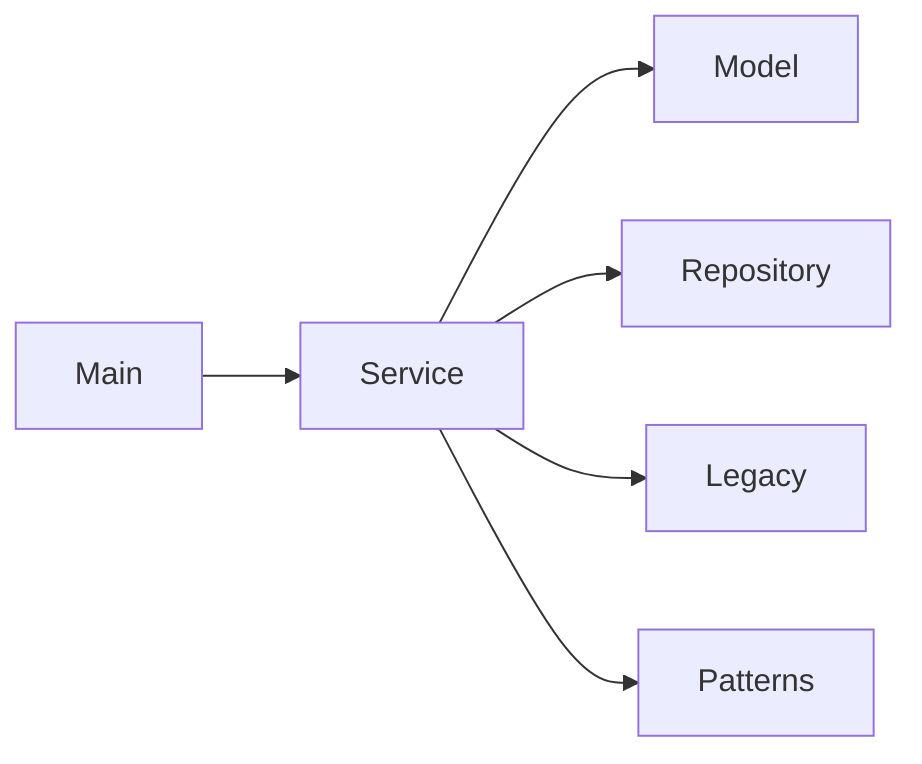

# Aula 05 - Componentes, conectores, configuração

## Componentes Principais

### Main

Responsável por iniciar o sistema e criar os objetos necessário para funcionar o EventHub.

### Service 

Coordenar as principai operações do sistema

### Model

Representa as entidades, seus atributos e seus tipos.

Classes:

- `Event.java`
- `Attendee.java`
- `Ticket.java`
- `Venue.java`

### Repository 
Armazenar os dados em memória

Classe:

`InMemoryRepository.java`

### Legacy

Responsável por representar as integrações externas do sistema.

Exemplos:

- Pagamento
- E-mail
- QR Code
- Fornecedores

## Diagrama de Componentes

